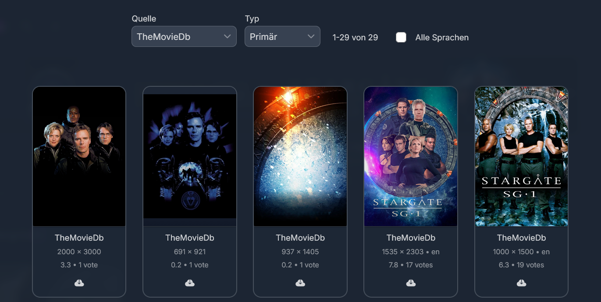
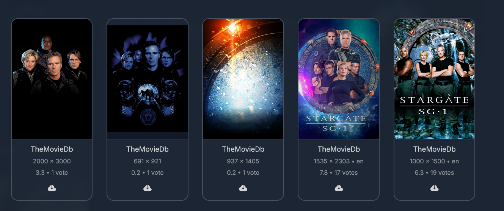

# TmdbMultiLanguage 

This Jellyfin plugin fetches movie and TV show images from TMDB with configurable multi-language support. It allows you to prioritize images in specific languages for your media library.

## 🎯 Why This Plugin?

### Jellyfin's Default Behavior

When you set Jellyfin's metadata language settings to a specific language (e.g., German), Jellyfin will **only** search for posters in that language. If no posters are found in the selected language, Jellyfin falls back to textless/language-neutral posters instead of checking other languages.

**This means:**
- If you set metadata to German, Jellyfin only looks for German posters
- If no German posters exist, it shows textless posters (which may be lower quality or unavailable)
- It won't automatically try English or other language posters as alternatives

### The Solution

This plugin solves this limitation by:
- Allowing you to configure **multiple language priorities**
- Fetching images in your preferred language order
- Ensuring you always get high-quality posters, even if your primary language isn't available

### Visual Example

| Before (Default Jellyfin) | After (TmdbMultiLanguage Plugin) |
|---------------------------|----------------------------------|
|  |  |

With the plugin, you get better poster coverage by checking multiple languages in your preferred order instead of falling back to textless posters.

## 📦 Install Instructions (Jellyfin)

1. Open **Jellyfin → Dashboard → Plugins → Repositories**
2. Click **Add Repository**
3. Enter the following URL: `https://raw.githubusercontent.com/Iceshadow1404/TmdbMultiLanguage/master/manifest.json`
4. Save, then go to **Plugins → Catalog** and install the plugin.
5. Restart Jellyfin.

## ⚙️ Configuration

After installation, configure your language priorities in the plugin settings to match your preferences (e.g., German → English → Textless).

## 🛠️ Build Instructions

To build the project, follow these steps:

1.  **Restore dependencies:**
    ```bash
    dotnet restore
    ```
    *(This command fetches all necessary packages for your project.)*
2.  **Build the project:**
    ```bash
    dotnet build --configuration Release
    ```

## 📝 Note

**WIP** - This plugin is a work in progress. Please feel free to report any bugs or issues you encounter.
